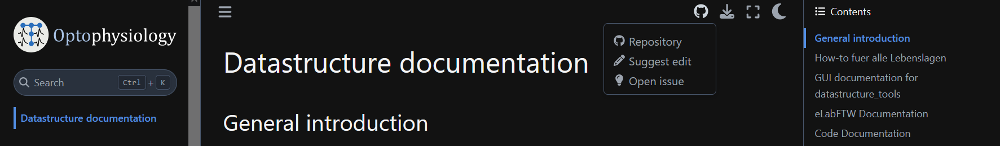
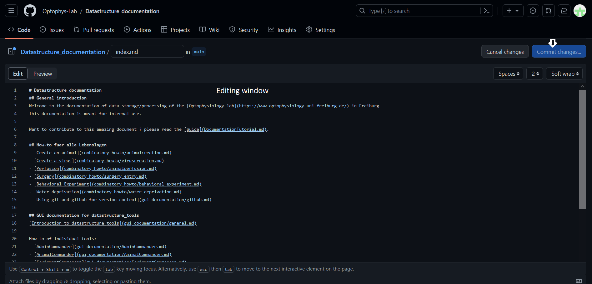
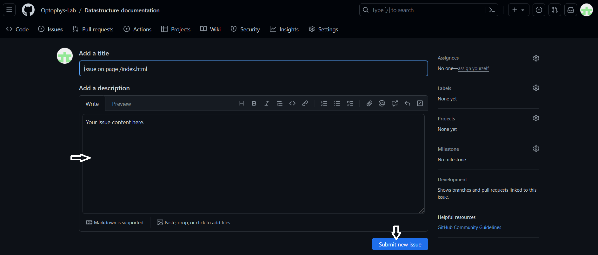

# Documentation about documentation

You found an error or typo ? 

For small typos please used the edit button


Then modify the corresponding document and commit changes. Those will appear automatically on the website after it is build.

You found a bigger issue or are missing something important?
Please create an issue on GitHub:


## Githubpages and jupyter-book
This page is currently being hosted via GitHub pages. The html is build using [jupyter-book](https://jupyterbook.org).

~~~~~~~~
pip install -U jupyter-book
~~~~~~~~

This adds search and index functionality. Furthermore, it allows straightforward integration of jupyter notebooks.

The repository is structured as follows:
- **_toc.yaml** defines the table of contents of the book 
- **_config.yaml** the configuration.
- **.github/workflows/deploy.yaml** defines the workflow for github-actions to build and deploy the pages.

To integrate new content, add new files and add them to **_toc.yaml**,  push changes to main.  
Once you push changes to main branch, github actions will be executed and compile and host the website.
You can try to build locally using jupyter-book from inside the repository:

~~~~~~~~
jupyter-book build ./
~~~~~~~~
open ./_html/index.html to view the locally build website.


## Formatting Guide for markdown(MD) files
Markdown files are text documents which can be used across multiple platforms.
When using jupyter-book instructional text can be entered as md files or jupyter notebooks.
see also <https://jupyterbook.org/en/stable/customize/config.html>

# <- Title
## <- Subtitle
### <- heading1
#### <- heading 2.. You get the idea...

**bold text** / _cursive_ / ~~strikedtrough~~ / 

## Lists

- item1
- item2
  - subitem1
    - subsubitem1

## Code
`
python -m "print('Hello World')"
`
> cd here and there
>

~~~~~~~~
Here comes some code.
~~~~~~~~
using language specific highlighting
```python
import time
time.sleep(int(5))
print(sleep.__dict__)
```

:::{warning}
You have been warned
:::

:::{note}Click me !
:class: dropdown
Hidden message
:::

## Cross - referencing
[link to file](README.md)

[linkt to website](https://www.optophysiology.uni-freiburg.de/)

## adding image


## math

$$
\begin{aligned}
  & \phi(x,y) = \phi \left(\sum_{i=1}^n x_ie_i, \sum_{j=1}^n y_je_j \right)
  = \sum_{i=1}^n \sum_{j=1}^n x_i y_j \phi(e_i, e_j) = \\
  & (x_1, \ldots, x_n) \left( \begin{array}{ccc}
      \phi(e_1, e_1) & \cdots & \phi(e_1, e_n) \\
      \vdots & \ddots & \vdots \\
      \phi(e_n, e_1) & \cdots & \phi(e_n, e_n)
    \end{array} \right)
  \left( \begin{array}{c}
      y_1 \\
      \vdots \\
      y_n
    \end{array} \right)
\end{aligned}
$$

## How to document code
Write docstrings ! 
