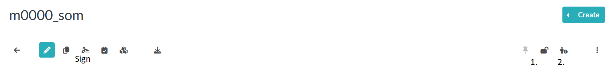

# How-to document animal experiments

## Everyday documentation
Use [WeightCommander](../gui_documentation/WeightCommander.md), [SurgeryCommander](../gui_documentation/SurgeryCommander.md), or [SessionCommander](../gui_documentation/SessionCommander.md)
to enter the information about the ongoing experiments.

## Signatures
Ensure you have created a [signature passphrase](../eLabFTW_documentation/generate_signature.md).

Sign **thoroughly checked** entries 
- in eLabFTW

- or in [WeightCommander](../gui_documentation/WeightCommander.md#signatures)

## Finish the documentation
- Go to the animal resource in eLabFTW
- Download the animal sheet
- Thoroughly check the animal sheet
- Are all the entries correct?
- Are all the signatures there?
- Are gesamtbelastung and end of experiment entered ?
If you have to modify something, come back next day and check newly created animal sheet (or force creation)

If everything was correct:

1. Lock the animal entry in eLabFTW (this will disable updating animal sheet for this animal)
2. Request Review from Steffi in eLabFTW

~~~~
written by: Artur
last modified: 2024-11-16
~~~~