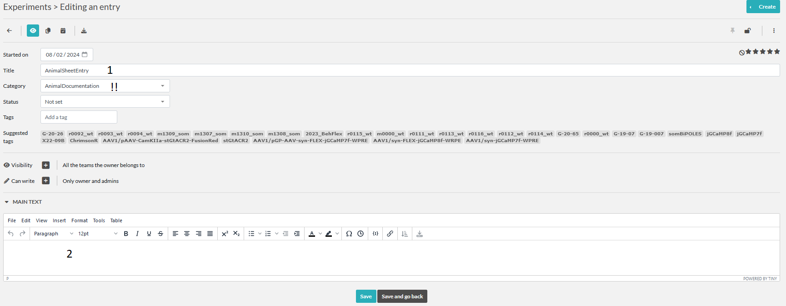

# Experiments: AnimalSheetEntry
Here we describe the fields of the experimental template for an animalsheetentry.
This is to be used if other available templates do not fit your need, and you need to enter some additional information
into the animal sheet. The crawler will transfer the information to the DB AnimalSheetEntry table, from where
automated animalsheets will be created.

:::{note} Note about auto-created entries
:class: dropdown
Entries of this type will also be autocreated if you use templates such as
[waterdeprivation](experiment_waterdep.md), [behavior](experiment_behavior.md), [surgery](experiment_surgery.md), [perfusion](experiment_perfusion.md).
For those you do not need to create manual entries.
:::

:::{note}
Remember you could also use [WeightCommander](../gui_documentation/WeightCommander.md) for more convenience.
:::

1. Any title is ok since it will be modified by the crawler. 
2. Any potential further notes

3. Choose animal, needs to be in DB, [if not](../combinatory_howto/animalcreation.md).
4. Check-date and time
5. Weight in gram
6. Person performing the check
7. Procedure
8. Water or food deprived
9. Medication if any
10. Housing
11. Besondere Vorkommnise
12. Weiterleben ?
13. Water during training or supplemented
14. Same for food

Now our new entry is in the list. To indicate that you finished entering the information about this entry, please lock
the item. After the item awaits the [crawler](crawler.md).

Crawler will check the entry for errors, if any it will leave a comment on the entry.
If everything seems correct the Crawler will add the entry to the DB and modify the entry.
todo CHECK WHAT CRALER WILL DO

## Modify entry
You can use [WeightCommander](../gui_documentation/WeightCommander.md) to modify the entry directly in DB. A modification message will be pushed to eLabFTW entry.

If you modify the entry directly in eLabFTW and would like this change to be transferred to DB and thus the animalsheet,
change the status of the entry to 'Need to be redone'. This will indicate fo crawler to pull new infos and update the 
information in DB.

## Sign entry
To sign an animal sheet entry with a legally binding signature, we use a timestamping service.
To this end the information in the entry is hashed and send to a server which adds temporal hash. This can be used to prove,
that the documented existed in this form at that timepoint.

:::{warning}
There are no take backs. One cannot modify or delete a timestamped experiment. However, one can ammend the information in the entry
and re-sign it. Sign entries only after checking those thoroughly.
:::

After signing the entry, on the next run of the crawler the corresponding entry will be marked as signed,
with info by whom and a link to this entry in eLabFTW. [See AnimalSheets](resource_animal.md#animalsheets)

~~~~
written by: Artur
last modified: 2024-02-09
~~~~