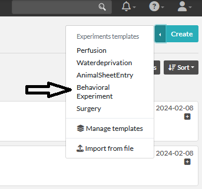
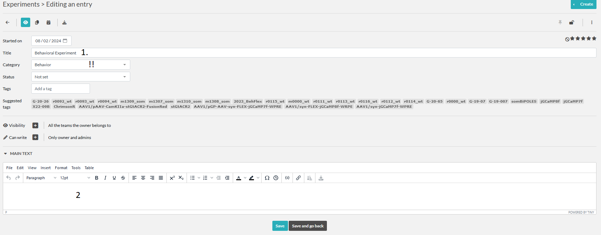
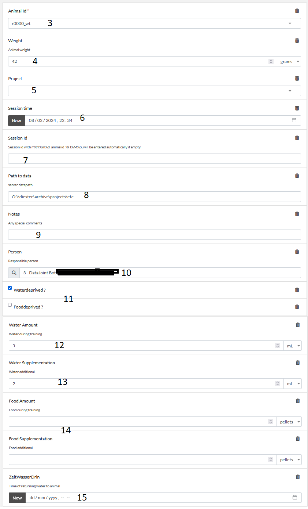

# Experiments: Behavior
Here we describe the fields of the experimental template for behavioral experiment or session creation.

:::{note}
The functionality of entry via the eLabFTW is very limited due to unavailability of checks and processing of 
entered data. Folder on the server cannot be created using eLabFTW. So consider using the [SessionCommander](../gui_documentation/SessionCommander.md).
:::

1. Any title is ok since it will be modified by the crawler. 
2. Any potential further notes. Session duration, program details, 
any further notes you would write down in normal labbook

3. Choose animal, needs to be in DB, [if not](../combinatory_howto/animalcreation.md).
4. Weight in grams.
5. Project dropdown. Projects from DB [TO add new ones](../gui_documentation/AdminCommander.md#adding-projects)
6. Session date and time.
7. Session_id if you have custum one, can be left blank then the crawler will create one for you in the format 
%Y%m%d_animalid_%H%M%S
8. Path to session data on the data server (optional, but highly recommended)
9. any notes about the session
10. Responsible person
11. Whether the animal was food or water deprived
12. Water amount received during training
13. Water amount received outside the training
14. Same for food (can be left blank)
15. If water was returned to the animal on this day, you can add ZWD time

Now our new entry is in the list. To indicate that you finished entering the information about this entry, please lock
the item. After the item awaits the [crawler](crawler.md).

Crawler will check the entry for errors, if any it will leave a comment on the entry.
If everything seems correct the Crawler will add the entry to the DB and modify the entry.
- It will change the title to : **session_id**
- it will add **animal_id** and **project** to the tags of this entry for easy search
- add a comment indication the successful sync to DB and creation of corresponding Session entry
- will create an animalsheet entry. Please check it and sign it !
- will link this entry to the animalsheet

## AnimalSheet
To fullfill the requirements from RP we need to sign every animal experiment.
As we already entered all the required information we can autocreate the animalsheet.
For this, please check the entered values and lock the item. After few minutes the Crawler
will create an [AnimalSheetEntry](experiment_animalsheet.md)

linked autocreated animalsheet entry.

[Sign the Animalsheet](experiment_animalsheet.md#sign-entry)

~~~~
written by: Artur
last modified: 2024-02-08
~~~~