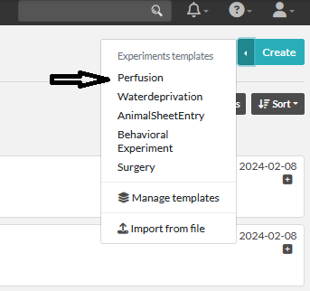
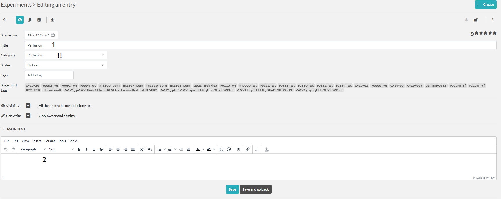
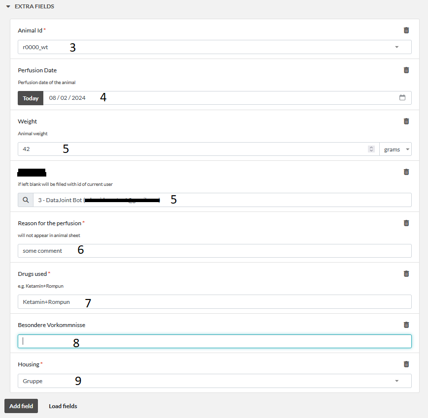
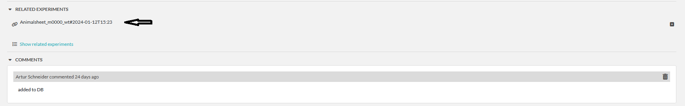

# Experiments: Perfusion
Here we describe the fields of the experimental template for perfusions.
This is a simplified template for AnimalSheetEntry. 

:::{note}
Remember you could also use [WeightCommander](../gui_documentation/WeightCommander.md) for more convenience.
:::

1. Any title is ok since it will be modified by the crawler. 
2. Any potential further notes

3. Choose animal, needs to be in DB, [if not](../combinatory_howto/animalcreation.md).
4. Perfusion date
5. Weight in gram and person performing the perfusion
6. Internal note about the reason of the perfusion. Will no appear in the animalsheet.
7. Medication for perfusion
8. Besondere Vorkommnise
9. Housing

Now our new entry is in the list. To indicate that you finished entering the information about this entry, please lock
the item. After the item awaits the [crawler](crawler.md).

Crawler will check the entry for errors, if any it will leave a comment on the entry.
If everything seems correct the Crawler will add the entry to the DB and modify the entry.
- It will change the title to : **Perfusion#animalid**
- it will add **animal_id** and **TVA** to the tags of this entry for easy search
- add a comment indication the successful sync to DB to the AnimalSheetEntry
- will create an animalsheet entry. Please check it and sign it !
- will link this entry to the animalsheet

## AnimalSheet
To fullfill the requirements from RP we need to sign every animal experiment.
As we already entered all the required information we can autocreate the animalsheet.
For this, please check the entered values and lock the item. After few minutes the Crawler
will create an [AnimalSheetEntry](experiment_animalsheet.md)

linked autocreated animalsheet entry.

[Sign the Animalsheet](experiment_animalsheet.md#sign-entry)
~~~~
written by: Artur
last modified: 2024-02-08
~~~~