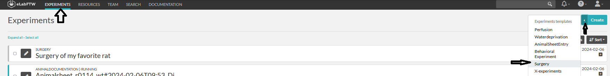
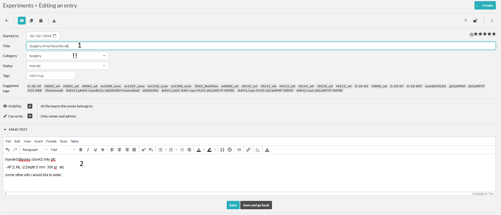
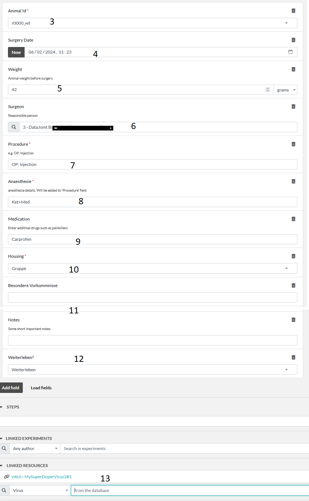
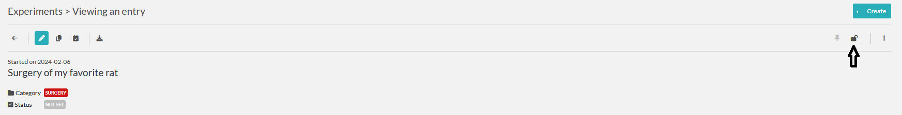

# Experiments: Surgery
Here we describe the fields of the experimental template for surgery.

:::{note}
The functionality of entry via the eLabFTW is very limited to unavailabilty of checks and processing of 
entered data. So consider using the [SurgeryCommander](../gui_documentation/SurgeryCommander.md).
:::

If you enter surgery information using eLabFTW, only the animalsheetentry about the surgery will be created. However, 
no transfer of coordinates, calculation of target coordinates, brain area, connection of experiments with this animal 
to the virus etc is possible.

Okay.. you still insist on entering it via eLabFTW ?

1. Any title is ok since it will be modified by the crawler. 
2. Please you the main text fields to enter your coordinates and angles, as well as details about the injection,
and implanted thingy. While those things will not be pushed to DB they still be documented in eLabFTW. 
Even better, you link the used virus(es) using the link resource field (13).

3. Choose an animal. Not present ?[Create an Animal](../combinatory_howto/animalcreation.md)
4. Surgery date
5. Weight in grams
6. Person doing the surgery
7. Procedure text for the animalsheet
8. Anesthesia details. e.g. Isoflurane(inhl.) will be appended to the procedure text.
9. Medication if any
10. Housing
11. Besondere vorkommnisse and notes(not for animalsheet just DB)
12. Weiterleben?
13. Link any viruses or other resourses used in the surgery. This allows easy and fast search of procedures with this virus.

Now our new entry is in the list. To indicate that you finished entering the information about this entry, please lock
the item. After the item awaits the [crawler](crawler.md).

Crawler will check the entry for errors, if any it will leave a comment on the entry.
If everything seems correct the Crawler will add the entry to the DB and modify the entry.
- It will change the title to : **Surgery#animal_id**
- it will add **animal_id** and **TVA** to the tags of this entry for easy search
- add a comment indication the successful sync to DB
- will create an animalsheet entry. Please check it and sign it !
- will link this entry to the animalsheet

## AnimalSheet
To fullfill the requirements from RP we need to sign every animal experiment.
As we already entered all the required information we can autocreate the animalsheet.
For this, please check the entered values and lock the item. After few minutes the Crawler
will create an [AnimalSheetEntry](experiment_animalsheet.md)

linked autocreated animalsheet entry.

[Sign the Animalsheet](experiment_animalsheet.md#sign-entry)

~~~~
written by: Artur
last modified: 2024-02-06
~~~~