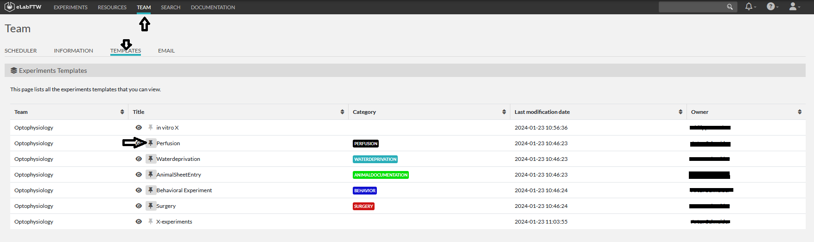

# Templates for experiments
for experiments which are often repeated and require a stereotyped entry of data,
a template can be used to improve data entry.
You can create your own templates of use the available team templates.

## Use available team-templates
To see the team templates in your suggestion menu when you want to create new experiment, you need to pin those experiments first.

Go to 'Team' / 'Templates' / click on the pin to pin corresponding template to your short list.