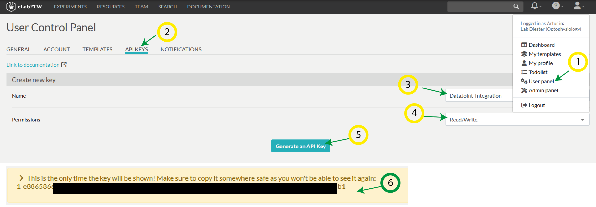

# How to generate API-key
This tutorial shows how to create an API-key for reading/writing data to eLabFTW 
from e.g. python-code or DataStructure-related tools

## Step1 Generate the key

1. Go to _User Panel_
2. Go to _API KEYS_
3. Enter a Name for the key (can be what-ever)
4. Set the permission to read+write
5. Click on **Generate an API Key** button
6. Copy the key shown. Save it somewhere! Its not possible to recover this. If you loose you will have to 
create a new one.

## Save the key in the AdminCommander
[Tutorial on AdminCommander](../gui_documentation/AdminCommander.md)

