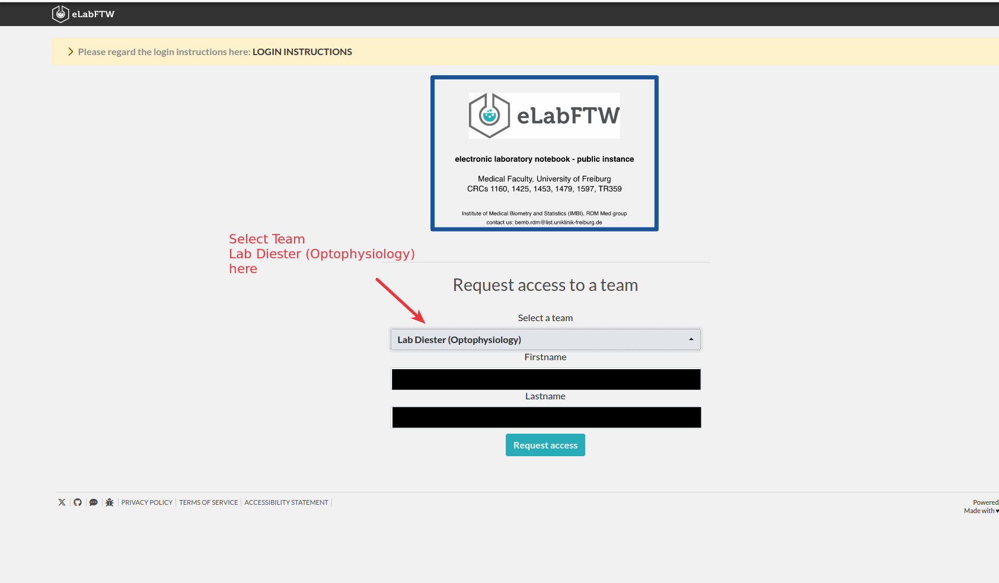

# Register an account / Login
Good news! you dont have to create yet another account to use eLabFTW. It supports using university-login now!

Please go to <https://eln.imbi.uni-freiburg.de/login.php>. For the **login** you just need the first 2 steps.

1. Use Login through your institution

you get forwarded to myLogin

2. Enter your university login and password, the email associated with the account will be used.
 

3. Select out team. You account now needs to be verified by an [Admin](administration_tools.md#confirm-users) before use.
 

After the verification you can access the eLabFTW from any computer, phone etc.

~~~~
written by: Artur and Florian
last modified: 2024-01-24
~~~~

