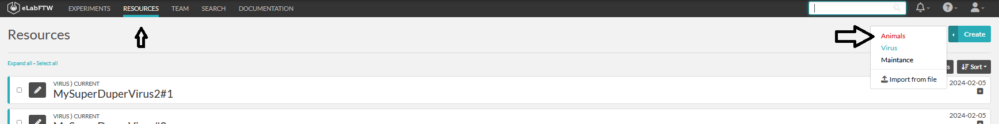
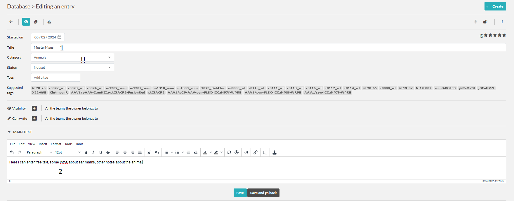
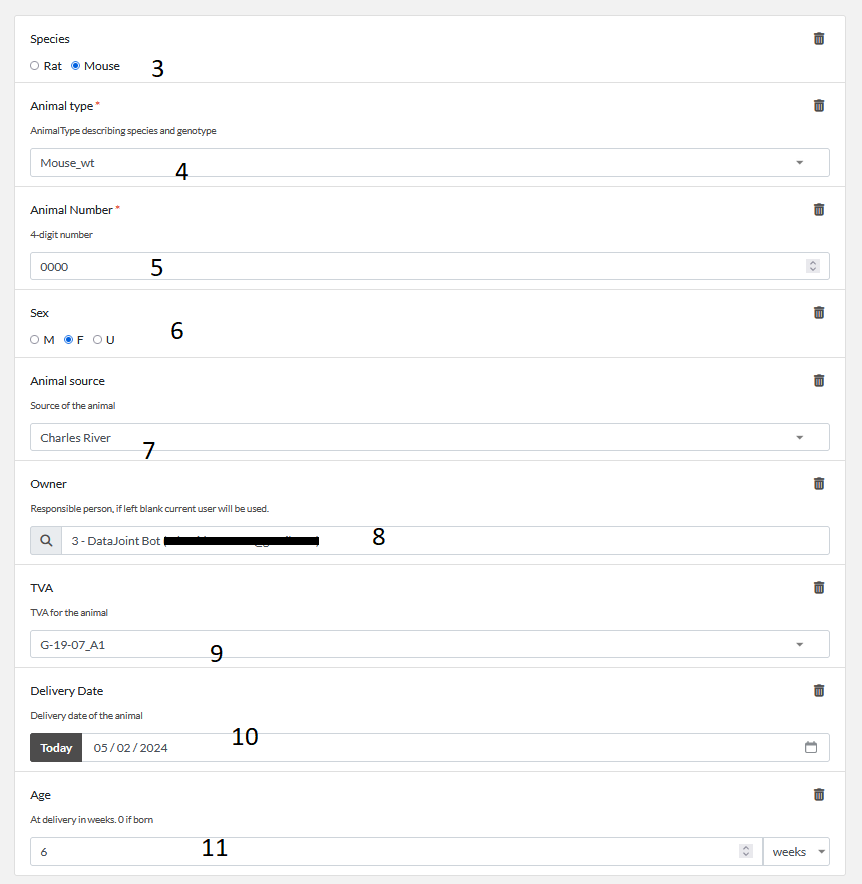
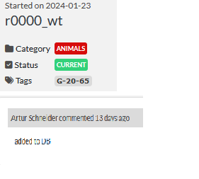
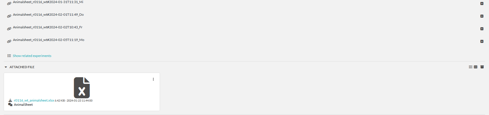
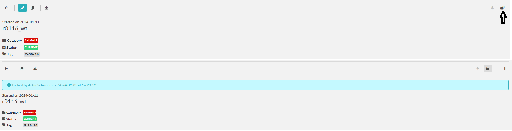

# Resource: Animals
Here we describe the fields of the animal resource template.

:::{note}
Remember you could also add animals more conveniently with [AnimalCommander](../gui_documentation/AnimalCommander.md)
:::

## Adding a new animal

To create a new animal entry please use the 'Animals' template under resources tab.

1. Title of the Entry. This will be modified by the crawler later, so can be anything atm.
For the crawler to find the entry, the category needs to be set correctly!!
2. Main Text. Free entry. Here you can add whatever free text entry. links, images etc. can be added.
This information will not be transferred to DB, but only kept in [eLabFTW](general_elabftw.md).
3. Species
4. Animal type for mice- genotype (Dropdown). 
The animal type you need is not available ? Please talk to Florian or Artur to get it added.
5. 4-digit subject number
6. Sex
7. Source of the subject (Dropdown)
8. Responsible person.
9. TVA under which the animal is registered
The TVA you need is not available ? Please talk to Florian or Artur to get it added.
10. Delivery date
11. Age at delivery. 0 if the animal was born at this date.

You can attach files (surgery images, earmarks, etc.)
You can try to draw your animal in the editor.

Now our new entry is in the list and awaits the [crawler](crawler.md).
It will check the entry for errors, if any it will leave a comment on the entry.
If everything seems correct the Crawler will add the entry to the DB and modify the entry.
- It will change the title to : **animal_id**
- it will add **TVA** as a tag.
- add a comment indication the successful sync to DB

## AnimalSheets
After experiments were added to eLabFTW, they will be automatically linked to
the animal entry by the crawler. You can see all entries related to an animal.

### Autocreating of the AnimalDocumentation
As all entries from eLabFTW or DB are entered into DB.AnimalSheetEntries table,
Based on those entries every night the crawler will create an animalsheet.

After the experiment is finished for an animal, please check the animalsheet and lock it.
This confirms the finished documentation. The animal sheet will not be updated anymore.
The whole animalsheet can now be signed by the authorized person.

~~~~
written by: Artur
last modified: 2024-02-05
~~~~
