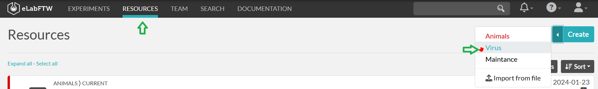

# Resource: Animal
Here we describe the fields of the resource template for animals.

:::{note}
Remember you could also add viruses more conveniently with {ref}'VirusCommander')
:::

:::{error}
currently its not possible to enter a new batch of an existing viruse
:::


:::{warning}
Please check that the virus you would like to enter is not already added! If you are addinga new batch of an exisiting 
virus, please ensure the correct name of the virus from previos batch for them to be linked correctly.
:::

## Adding a new virus or batch

To create a new virus/batch entry please use the 'Virus' template under resources tab.

Now you can enter the individual fields of the template. Some fields are required, others are optional


1. Title of the Entry. This will be modified by the crawler later, so can be anything atm.
For the crawler to find the entry, the category needs to be set correctly!!
2. Main Text. Free entry. Here you can add whatever free text entry. links, images etc. can be added.
This information will not be transferred to DB, but only kept in [eLabFTW](general_elabftw.md).
3. Unique full name of the virus. Try to keep the convention similar to already added viruses.
4. Dropdowns for parts of the virus, opsin if any, reporter protein, vector , promotor etc. 
Whether the expression is dependent on the cre presence. If any of the fields does not contain the desired field,
please add those via [VirusCommander](../gui_documentation/VirusCommander.md)
5. Addgene number (optional)
6. Origin of the virus
7. Identifier from origin (optional)
8. Delivery date
9. Titer, in particles/ml. Please enter the whole number or using '1.2e12' notation.
10. Enter the batch number. 0 for a new virus.
11. Number of our internal box nr where the virus i stored in the freezer.

Now our new entry is in the list and awaits the [crawler](crawler.md).

Crawler will check the entry for errors, if any it will leave a comment on the entry.
If everything seems correct the Crawler will add the entry to the DB and modify the entry.
- It will change the title to : **virusid#batchnr**
- it will add **virusid** and the opsin to tags of this entry
- add a comment indication the successful sync to DB

After the crawler treatment, the virus can be linked to experiments using the **Linked resources** entry.


## How to modify a virus 
why tho ?

Atm, this is not really implemented. In eLabFTW one can edit any field, however, the changes will not be synched to DB.
In the DB to change any values, one needs to access the individual entries via 
```python
DB.Virus.update1(**kwargs)
```

~~~~info
written by: Artur
last modified: 2024-02-05
~~~~