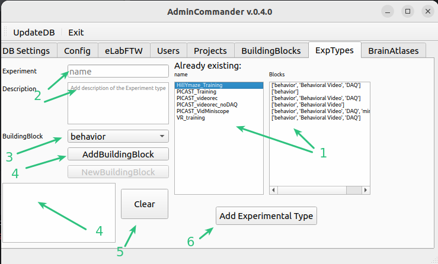

# AdminCommander
GUI for managing server connection as well as user settings. Projects, Experiments and datatypes can be created here, 
as well as atlas files copied to local fodlers for fast access. eLabFTW API key can be entered here.

[code here](../code_documentation/AdminCommander.html)

## DB configuration
Here we enter the information for connection to DB. This needs to be done once after installation.
If you install datastructure_tools in a different env or different computer you will need to enter this again.

1. This indicates whether any connection to a DataJoint DB was perfomed before.
2. Enter here the ip adress and user_id (e.g. optouser) and password. If you dont know those, please ask some knowledgeable person in the lab.
3. Choose a database to use. We have _opto_db_ as our main DB and _opto_db_test_ as test instance. Please use
_opto_db_test_ if you are just playing around. And _opto_db_ if you know what you are doing.
4. Press Save. If you entered correct credentials you will get a message and now datastructure_tools now has a 
connection to DB. Please restart DB.

## User-specific config
Here you can enter settings which will improve user experience. Some choises you save here will be used in further GUIs,
thus saving you time. E.g. The user will be automatically set to you. 

1. Select you user id. Not present ? [Add yourself](#adding-users)
2. Choose your project. Not present ? [Add project](#adding-projects)
3. Choose your typical experiment. Not present ? [Add ExpType](#experimental-types)
4. Choose a default exp-folder. This dropdown shows the top-level folders in the project folder. [Not sure what this means?](../datastructure_documentation/datastructure.md)
5. In case the diester-data server is not under default path on your computer (those are /mnt/diester/archive/projects 
or O:/archive/projects) this field will be enabled. You can browse to the archive/projects folder and this will be saved
as parent part of the path structure.  [Not sure what this means?](../datastructure_documentation/datastructure.md)
6. In case you plan to use [FileCommander](FileCommander.md) or [SessionCommander](SessionCommander.md) you can save the paths of were typically your experimental 
data for different modalities is saved locally. E.g. behav_video maybe saved somewhere else from daq data. This will 
allow you for fast selection of appropriate files, as the file browser will point you directly to saved folders.
in 6. you can choose what modality of chosen ExpType you want to save
7. here you can indicate the source folder.
8. Clear will remove entered information about paths
9. Will show the overview of paths for each modality after entry.
10. Press to save user configs.

## Adding Users
Here you can register new users of the database. IMPORTANT! those are not user which connect to the [DB](#db-configuration)

1. List of users already added to DB
2. Entry field for new users. Please use your RZ-id e.g. aa1000
3. Press add

## Adding Projects
Here you can register new Projects to the database. IMPORTANT! only those projects can be registered 
which are in top-tree of archive/project. If you need new one and dont have a folder yet. Ask administration to create one.
Refer to general [datastructure](../datastructure_documentation/datastructure.md)

1. List of projects already added to DB
2. Dropdown with folder at top-level of archive/project
3. Enter a short description of the project.
4. add keywords separated by , or /
5. If you would like to create a Experiments folder you can check it and enter a name
6. Press to Add

## Building Blocks of datastructure
Read [datastructure](../datastructure_documentation/datastructure.md) first.
Here we define file-structure for modalities of data-building blocks.
Existing buildingblock should be reused if they fit to you data modality.

1. Existing Blocks and corresponding folder names
2. enter a new building block with short desc
3. enter the name of the raw folder for this data modality
4. by default preprocessed and processed folders will have same names, if you wish to change those or dont have a 
processed folder at because this modality will be combined with other during preprocessing and thus doesnt need its own
folder, please check modify and enter names (processed can be blank, then no processed folder will be created)
5. Press add

## Experimental types
Aka combination of blocks. Here we combine different block for different types of experiments.
E.g you may do experiments with only ephys or with ephys+behavior.

1. Existing Experimental types and corresponding building blocks
2. enter a new xperimental type with short desc
3. choose a building block to add. [Add new](#building-blocks-of-datastructure)
4. list of temporarily added blocks
5. Press clear to remove all and restart entering
6. If you are happy with you blocks Press Add

## Enter API-key for eLabFTW
To be able to automatically push elements from DB to eLabFTW you will need an API-key which will be used to login 
through the API. [Get your API-key](../eLabFTW_documentation/generate_apikey.md) 

1. Enter the key in the Admincommander
2. Save

After saving the key, the programm will try to connect and thus verify the key. If everything worked as expected
the key will be stored in 

## Copy brain atlases
Here you can copy the brain atlas files to your local folder inside the datastructure_tools. This will allow to use them
in [SurgeryPlanner](SurgeryPlanner.md) and [SurgeryCommander](SurgeryCommander.md).

1. Choose an atlas to copy
2. Press button

~~~~
written by: Artur
last modified: 2024-01-24
~~~~