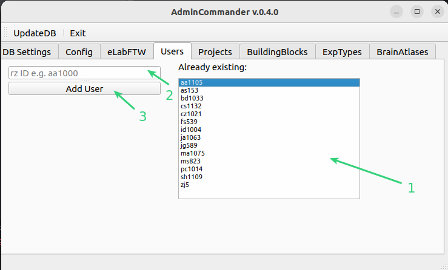
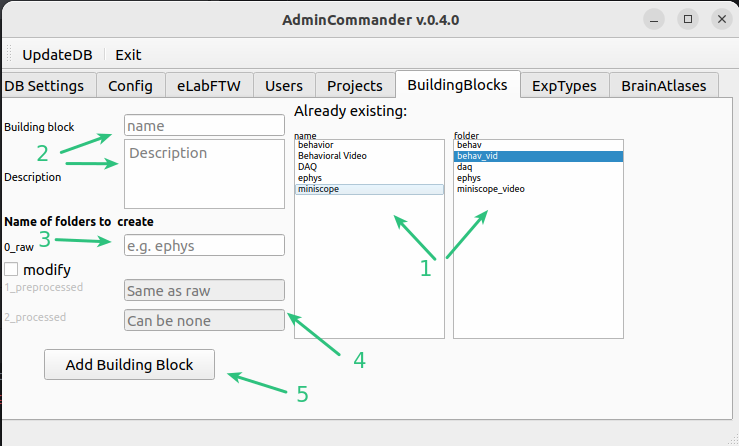
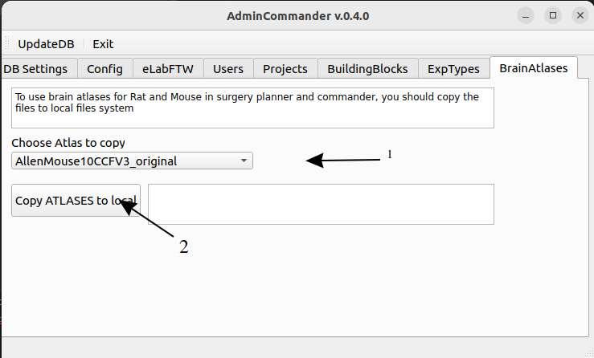

# AdminCommander
GUI for managing server connection and user settings. Projects, experiments and datatypes can be created here, 
and copy atlas files to local folders for quick access. eLabFTW API key can be entered here.

:::{note}Start
From the datastructure_tools directory run
~~~bash
python ./AdminCommander.py
~~~
or from any directory
~~~bash
python -m datastructure_tools admin
~~~
:::

:::{error}
:class: dropdown

In case you get this error when starting the AdminCommander, this means the dataserver is not under default path.
Please configure the path to the server via [5](#user-specific-config).
:::

## DB configuration
Here we enter the information for connection to DB. This needs to be done once after installation.
If you install datastructure_tools in a different folder or different computer you will need to enter this again.

1. This indicates whether any connection is established to the DB. If it says "Not connected" you need to enter the credentials in following steps, if there are values shown, you are connected.
2. Enter here the ip adress and user_id (e.g. optouser) and password. If you dont know those, please ask some knowledgeable person in the lab.
3. Choose a database to use. We have _opto_db_ as our main DB and _opto_db_test_ as test instance. Please use
_opto_db_test_ if you are just playing around. And _opto_db_ if you know what you are doing.
4. Press Save (or change connection if you are already connected). If you entered correct credentials you will get a message and now datastructure_tools now has a 
connection to DB. Please restart AdminCommander.

:::{note} Manual changes
:class: dropdown
This information can also be manually edited in datastructure_tools/DataJoint/server_config.json
:::

## User-specific config
:::{note} 
User settings are not required, they require a connection to our fileserver. If you do not have access to the fileserver, you can skip this step.
:::

Here you can enter settings that improve the user experience. Some settings you save here will be used in other GUIs,
saving you time. For example, the user will automatically be set to you.

1. Select your user ID. Not present? [Add yourself](#adding-users)
2. Select your project. Not present? [Add project](#adding-projects)
3. Select your typical experiment. Not available ? [Add ExpType](#experimental-types)
4. Select a default Exp folder. This dropdown shows the top level folders in the project folder. [Not sure what this means?](../datastructure_documentation/datastructure.md)
5. If the diester data server is not under the default path on your computer (these are /mnt/diester/archive/projects 
or O:/archive/projects) this field will be enabled. You can browse to the archive/projects folder and it will be saved as the
as the parent part of the path structure.  [Not sure what this means?](../datastructure_documentation/datastructure.md)
6. If you plan to use [FileCommander](FileCommander.md) or [SessionCommander](SessionCommander.md), you can save the paths where your experimental data is typically stored for different modalities. 
data for different modalities are stored locally. For example, behav_video may be stored somewhere other than the daq data. This will 
This will allow you to quickly select the appropriate files, as the file browser will point you directly to the saved folders.
In 6. you can select which modality of the selected ExpType you want to save.
7. Here you can specify the source folder.
8. Clear will remove the entered information about paths
9. Will show the overview of paths for each modality after input.
10. Press to save user configurations.

:::{note} Manual changes
:class: dropdown
This information can also be manually edited at datastructure_tools/user_config.json
:::

## Enter API-key for eLabFTW
To automatically push items from the DB to eLabFTW, you need an API key, which is used to log in to the API. 
through the API. [Get your API key](../eLabFTW_documentation/generate_apikey.md) 

1. Enter the key in the Admincommander
2. Save

After saving the key, the program will try to connect and verify the key. If everything works as expected
the key will be saved in *user_config.json*.

## Adding Users
Here you can register new database users. IMPORTANT! these are not users the same that connect to the [DB](#db-configuration)
While those usernames can be chosen freely we advise to use the RZ-IDs here.

:::{note} Important
Please also send the new user_id to one of the administrators of the eLabFTW, so the internal_id can be set correctly.
:::

1. List of users already added to DB
2. Entry field for new users. Please use your RZ-id e.g. aa1000
3. Press add

## Adding Projects
Here you can add new projects to the database. IMPORTANT! only those projects can be registered 
that are in the top tree of the archive/project. If you need a new one and do not have a folder yet. Ask the administration to create one.
Refer to general [datastructure](../datastructure_documentation/datastructure.md)

### Conventions to name your project folder:
As people started creating new project folders, we realized that we needed a clearer naming convention for them, and the sooner we implemented it the better (it will be a lot more work later than it is now).
The idea of the organization was to distinguish between a project as an overarching name and different experiments within the project.
To keep the folder organized, it would be great to name the project like this \<year>_\<descriptive name or grant>. Within these project folders you can keep different experiments.
For example, a project could be 2014_ERC and an experiment within it could be Betaburst_reinforcement.
Not ideal names would be 2024_Behavior, since many people do behavior and neither the goal nor the grant is obvious.
Also problematic is something like 2023_ALM, as many people can work on that structure, and it is not directly understandable what the goal of that project is.
Also, it would be ideal to keep the project folder sparse, i.e. only create multiple project folders if they are really distinct in the sense that they contain completely different experiments/have different goals.

1. List of projects already added to DB
2. Dropdown with folder at top-level of archive/project
3. Enter a short description of the project.
4. add keywords separated by , or /
5. If you would like to create an Experiments folder you can check it and enter a name, this will create this folder under the project folder. Ensure you have writing right in this folder!
6. Press to Add

## Building Blocks of datastructure
Read [datastructure](../datastructure_documentation/datastructure.md) first.
Here we define file-structure for modalities of data-building blocks.
Existing buildingblock should be reused if they fit to you data modality.

Building Blocks are templates of default prestructure of experimental procedures.
These procedures can be:
- miniscope recordings
- 2P in vivo
- 2P in vitro calcium imaging
- electrophysiology in vivo
- behavioral recordings
- patch clamp recordings
- etc

1. Existing blocks and corresponding folder names
2. enter a new block with a short description
3. enter the name of the raw folder for this data modality
4. by default, preprocessed and processed folders have the same names, if you want to change them or do not have a processed folder 
processed folder, because this modality will be combined with others during preprocessing and therefore does not need its own folder.
folder, please check Change and enter names (processed can be empty, then no processed folder will be created).
5. Press Add

## Experimental types
Aka combination of blocks. Here we combine different block for different types of experiments.
E.g you may do experiments with only ephys or with ephys+behavior.

Example experimental profiles per user/type of experiment: 	
- BriceExperiment1 [miniscope, behavior]
- BriceExperiment2 [miniscope]

1. Existing Experimental types and corresponding building blocks
2. enter a new experimental type with short desc
3. choose a building block to add. [Add new](#building-blocks-of-datastructure)
4. list of temporarily added blocks
5. Press clear to remove all and restart entering
6. If you are happy with you blocks Press Add

## Copy brain atlases
Here you can copy the brain atlas files to your local folder inside the datastructure_tools. This will allow to use them
in [SurgeryPlanner](SurgeryPlanner.md) and [SurgeryCommander](SurgeryCommander.md).
You dont need to copy them if you are not planning to use these tools in detail.

1. Choose an atlas to copy
2. Press button

~~~~
written by: Artur
last modified: 2024-10-22
~~~~
