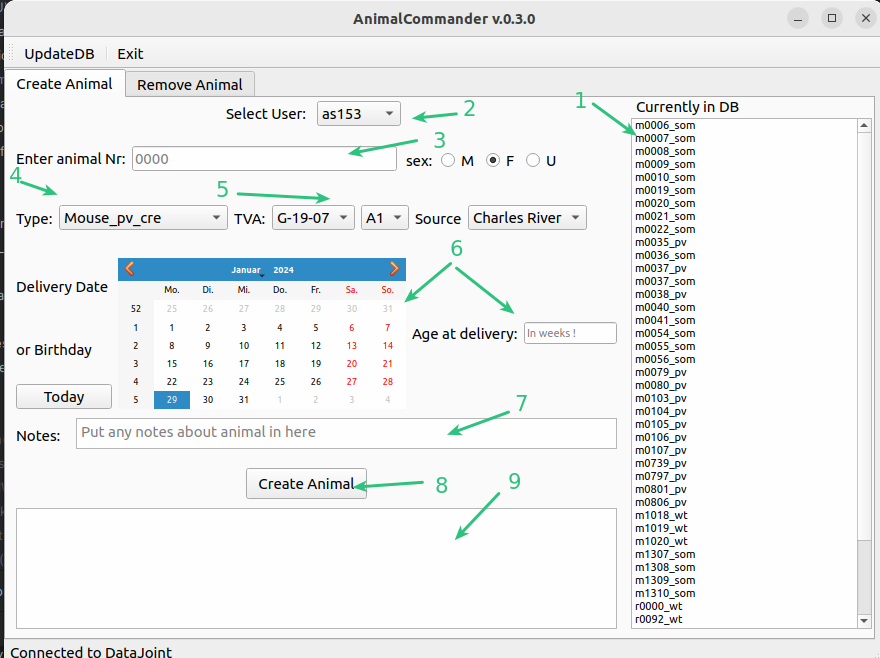
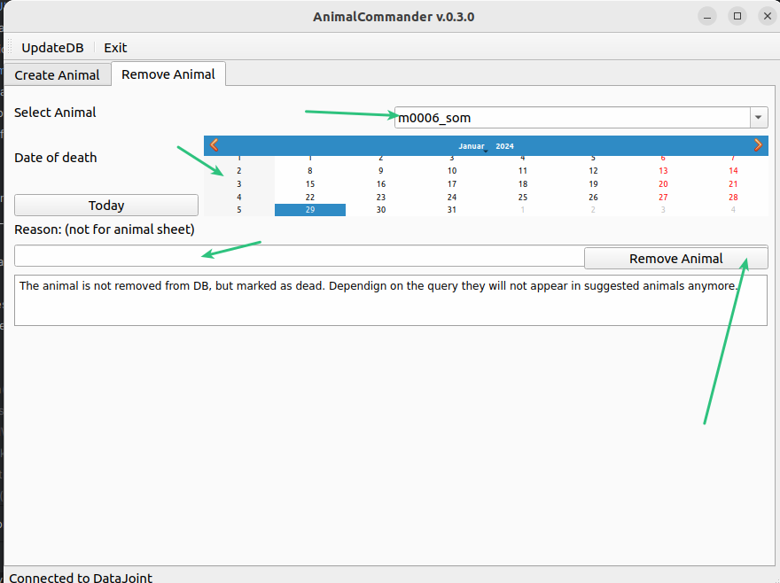

# AnimalCommander
GUI for managing animals. New animals can be added to DB and animals can be marked as perfused/dead.
Entering a new animal here will automatically push it also to eLabFTW.

[code here](../code_documentation/pdoc_datastructure_tools/datastructure_tools/AnimalCommander.html)

## Add new animal to DB 
To add a new animal to DB using GUIs you will need: 4-digit animal number, animal type(strain for rats and genotype 
for mice) as well as the TVA the animal rans at, and the source of the animal.

1. list of animal currently in DB
2. Choose Owner (is automatically set to the [saved settings](AdminCommander.md#user-specific-config))
3. Enter the 4-digit animal number
4. Choose animal type. For Mice this contains the genotype information such as som_cre. For rats the strain SD or
LongEvans. The animal type you need is not available ? Please talk to Florian or Artur to get it added.
5. Choose the TVA and the source of the animal.  The TVA you need is not available ? Please talk to Florian or Artur to get it 
added.
6. Choose the delivery or birthday of the animal and enter Age. If animal was born please enter 0 as Age.
7. Any note about this animal. Can be left blank
8. Create Animal
9. Logging of DB-response

## Remove animal from DB
To mark an animal as dead, and thus not get it suggested in many other GUIs. The animal and all associated entries
are not removed from the DB, but rather a new entry is made indication the animal is ex.

1. Choose the animal to be marked  as dead
2. Choose a date
3. enter a reason(only for internal, not pushed to animal sheet)
4. Press remove animal

~~~~
written by: Artur
last modified: 2024-01-30
~~~~