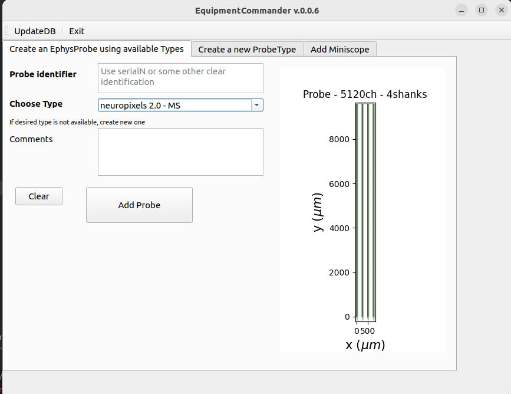
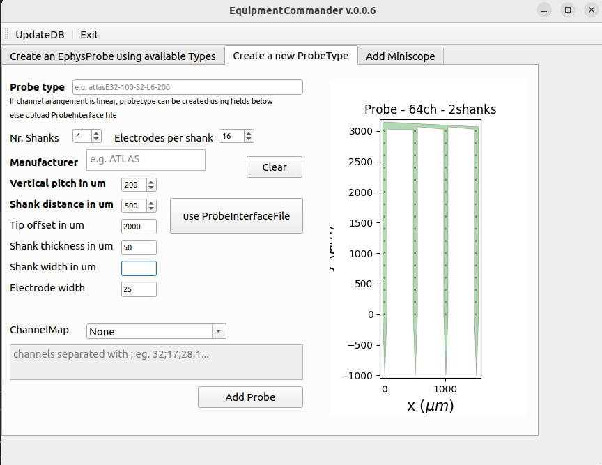

# EquipmentCommander

GUI for adding Ephys probes with defined electrode configuration and miniscopes (not implemented yet).
You can create a specific geometric arrangement of electrodes in the probe. This can be used later for spike sorting as well as 
and electrode/neuron localization.

:::{note}Start
From the datastructure_tools directory run
~~~bash
python ./EquipmentCommander.py
~~~
:::
:::{error}
:class: dropdown

In case you get this error, no connection can be established to MySQL. Ensure you entered correct credentials 
first using [AdminCommander](AdminCommander.md#db-configuration).
:::

## Add new Probe for existing types

Enter a unique identifier for the probe, such as a serial number, etc.
You can add any comments about this probe.
Select the type of probe. If the desired type does not exist, create a new one:
## Add new Probe Type
You can create a new electrode type by entering the appropriate values for the electrode arrangement, number of waves 
etc. You can also upload a [ProbeInterface](https://probeinterface.readthedocs.io/en/main/) file, a library that allows you to define and visualize probe geometries.
The library also allows to use the probe geometries in spikesorting.

## Add new miniscope
Not implemented

~~~~
written by: Artur
last modified: 2024-10-22
~~~~