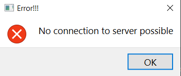

# EquipmentCommander

GUI for adding Ephys probes with defined electrode configuration and Miniscopes(not implemented yet).
One can create specified geometric arrangement of electrodes in the probe. This can later be used for spike sorting as 
well as electrode/neuron localization.

:::{note}Start
From the datastructure_tools directory run
~~~bash
python ./EquipmentCommander.py
~~~
:::
:::{error}
:class: dropdown

In case you get this error, no connection can be established to MySQL. Ensure you entered correct credentials 
first using [AdminCommander](AdminCommander.md#db-configuration).
:::

## Add new Probe for existing types

Enter a unique identifier name for the probe, like a serial number, etc.
You can add any comments about this probe.
Choose the type of the probe. The type you want does not exist ? create a new one:
## Add new Probe Type
One can create new electrode-type by entering the corresponding values for the electrode arrangengment and nr of shafts 
etc. One can also upload a ProbeInterface file, a library which allows definition of probe geometries and visualization.
The Library also enables using the probe geometries in the spikesorting.

## Add new miniscope
Not implemented

~~~~
written by: Artur
last modified: 2024-02-12
~~~~