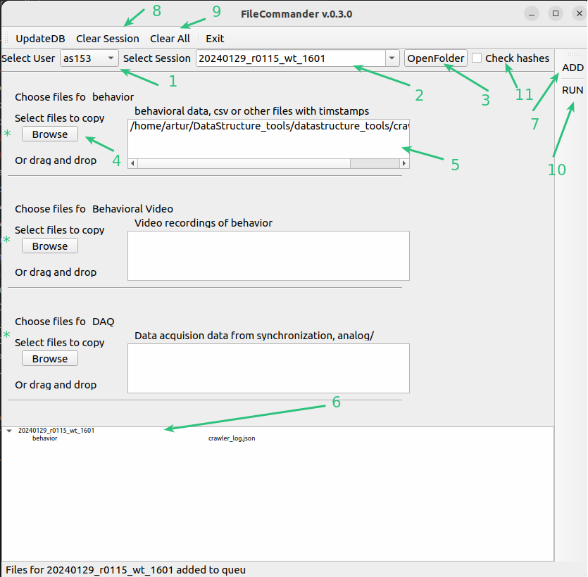

# FileCommander
This tool can be used to copy the data into correct file structure according to the datastructure rules.

- [Details about datastructure](../datastructure_documentation/datastructure.md)
- [how to create BuildingBlocks and ExpTemplates](AdminCommander.md#building-blocks-of-datastructure)

1. Select user. Is preselected according to the [saved settings](AdminCommander.md#user-specific-config)
2. List of session from this user, sorted most recent -first
3. Press to open the raw folder of this session on the server (Folder were already created at session creation)
4. Press browse to select files for this types of data modality. The default path which opens for each modality can 
be set in [AdminCommander](AdminCommander.md#user-specific-config). You can also drag and drop files to window in 5
5. List of files to be added for this modality and this session
6. List of files for all session in current Queu
7. Press add to add currently selected files (from 5) to the to copy Q
The idea here is that you can select files for multiple sessions at once and then run a batch copy job. For example at the end of each day.
8. To remove all files from Queu and current selection for this session
9. For all session
10. This executes the file copying. May take a while, the program may appear to hang. Dont close.
11. Check whether the program should verify file integrity after copy. More secure but takes longer.

*. Indicates different building block of the exp template of this experiment there may be more or less of those.

You record different data modalities on different computers ? No problem, FileCommander can be used in a distributed manner.
Install [datastructure_tools](../gui_documentation/installation.md) on each computer and just select the correct session and copy the individual files for each modality.

~~~~
written by: Artur
last modified: 2024-02-02
~~~~