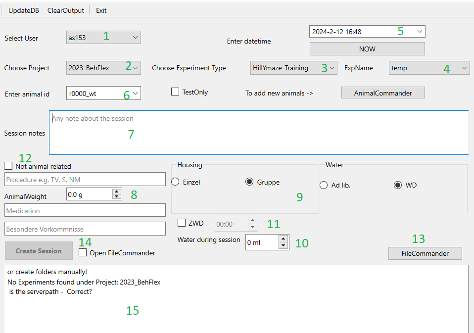

# SessionCommander
This tool helps organize your daily experiments according to [datastructure](../datastructure_documentation/datastructure.md)
It gives each session an clear identifier (**session_id**) and links all session via the animal.
At creation time of the session entry, a folder-tree is created in our dataserver according to defined datastructure rules.
It furthermore can be integrated with [FileCommander](FileCommander.md) to directly copy session files into corresponding 
folders.

:::{note}Start
From the datastructure_tools directory run
~~~bash
python ./SessionCommander.py
~~~
:::

:::{error}
:class: dropdown

In case you get this error, no connection could be established to MySQL. Ensure you entered correct credentials 
first using [AdminCommander](AdminCommander.md#db-configuration).
:::

1. Choose user (is automatically set to the [saved settings](AdminCommander.md#user-specific-config)), but can be changed. [add](AdminCommander.md#adding-users)
2. Choose project [add](AdminCommander.md#adding-projects)
3. Choose ExpType [add](AdminCommander.md#experimental-types)
4. Choose exp folder (folders in the root of project)
5. Choose session datetime or press now to get current datetime
6. Choose animal [add](AnimalCommander.md)
7. Notes about the session (not besondere Vorkommnisse)
8. AnimalSheet related infos such as weight, procedure, medication if any,
9. Housing, waterdeprivation
10. Water amount during training
11. Check and enter time if water was returned to the Animal
12. Check if session is not animal related and does not require an animlsheetentry
13. Open [FileCommander](FileCommander.md)
14. Create a session (this will also create the folder tree on the server), if FileCommander is checked will open FileCommander afterwards to
copy te session files for the corresponding sess
15. Console output

~~~~
written by: Artur
last modified: 2024-02-12
~~~~