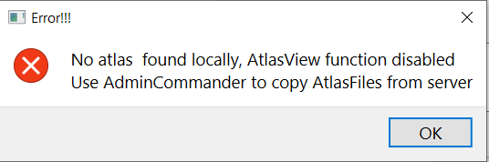
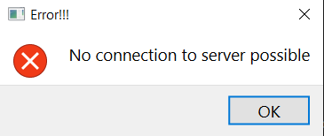
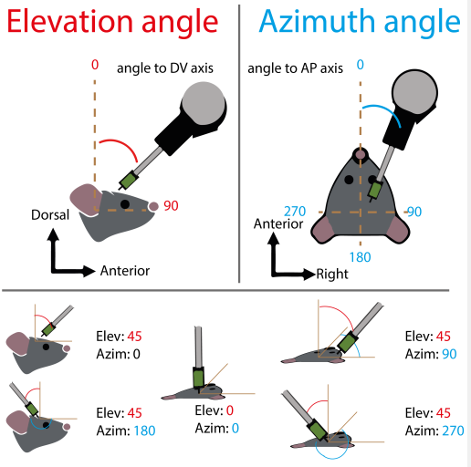
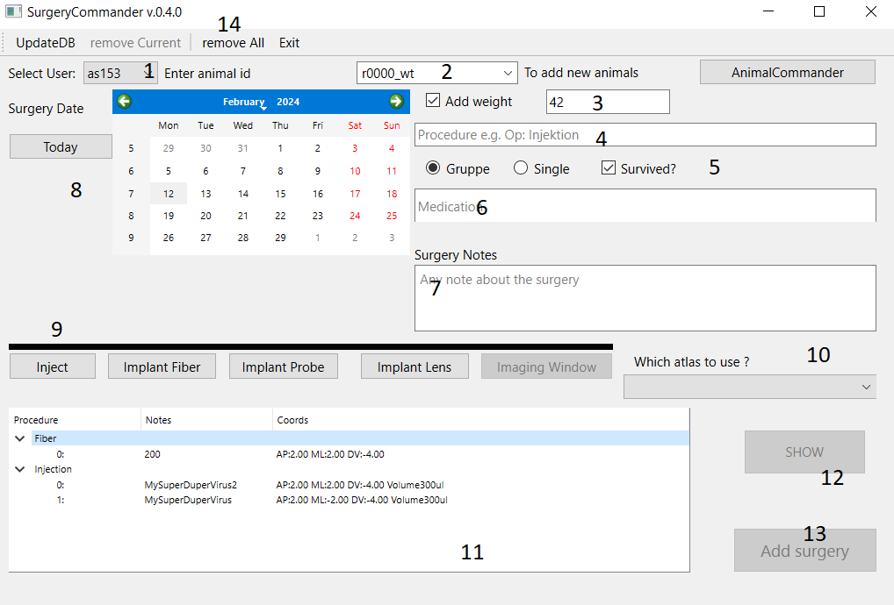
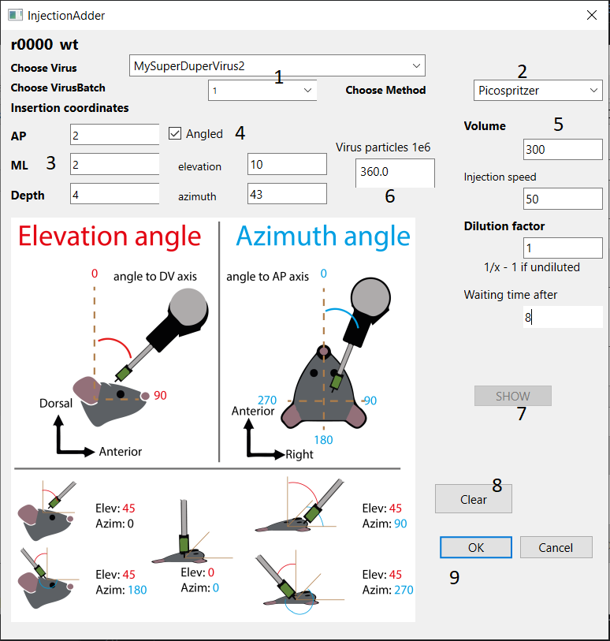
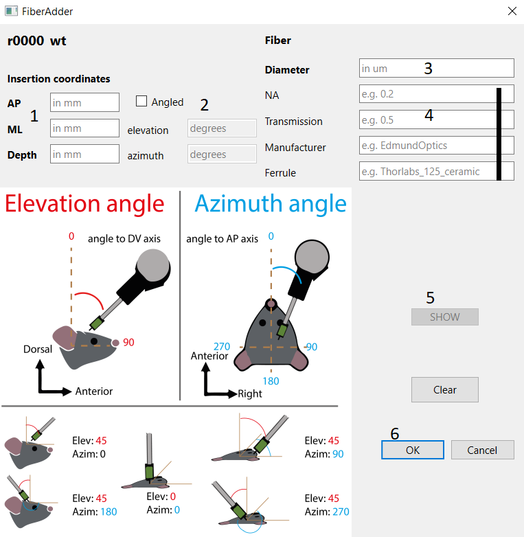

# SurgeryCommander
This gui allows entering surgeries to the DB.
Beyond the animal documentation aspect of the surgery, this tool enables DB integration of Viruses, Probes and 
coordinates. A surgery can contain one or several individual steps such as injections or implantations.
The tool lets you input the coordinates you used during the surgery (AP/ML on the brain surface) and depth of insertion.
Then using atlas data the tool can automatically calculate where the target is and associate a brain-area with it.

:::{error}

In case you get this error, please copy the atlase files first using [AdminCommander](AdminCommander.md#copy-brain-atlases).
:::

:::{note}Start
From the datastructure_tools directory run
~~~bash
python ./SurgeryCommander.py
~~~
:::

:::{error}
:class: dropdown

In case you get this error, no connection can be established to MySQL. Ensure you entered correct credentials 
first using [AdminCommander](AdminCommander.md#db-configuration).
:::

## Definition of insertion angles
To have the same nomenclature for insertion coordinates and angles please use following convention:

- AP and ML coordinates are given in mm from Bregma
- Depth of the insertion is recorded from brain surface
- Angle to the stereotactic arm relative to DV axis is called elevation and can be 0-90 degrees
- Angle around the AP axis is called Azimuth and can be 0-360 degrees
- Please note azimuth is only meaningful if elevation is not 0 !
- Insertion from the right: azimuth 90 degrees
  - from the left: 270 
  - from the back: 180
  - from the front: 0 

## General surgery entries

1. Choose User (is automatically set to the [saved settings](AdminCommander.md#user-specific-config)), but can be changed
2. Choose Animal 
3. Add weight (Is mandatory now)
4. Add procedure and anesthesia details
5. Housing and Weiterleben
6. Medication (You can also use the *addDrugs* button to add default drugs)
7. Notes about surgery (not for animal sheet)
8. Surgery date
9. Buttons for individual entries for Injcetions, Implantations, etc
10. Atlas dropdown for visualizations (optional)
11. List of Items added to the surgery    
12. To show selected entry in atlas-view (greyed out if no atlas available)
13. Add surgery to DB and AnimalSheetEntry
14. Clear all entries in case things were entered not correctly (only before pushing to DB)

If you have entered the API-key for eLabFTW in the [AdminCommander](../gui_documentation/AdminCommander.md#enter-api-key-for-elabftw) 
the information about the surgery such as what injections and where are pushed to eLabFTW.

Also an AnimalSheet entry is created from the information entered.

### Injections
To add injections push the corresponding [button](#general-surgery-entries).

1. Choose virus and batch. [Not available ? add](../combinatory_howto/viruscreation.md)
2. Chose injection method
3. Coordinates
4. Angles if angled
5. Virus volume injected and further optional fields
6. Autocalculated amount of virus particles injected(if titer is available)
7. To show selected entry in atlas-view (greyed out if no atlas available).
8. Clear all fields
9. Add injections to list

## Fiber implantation
To add injections push the corresponding [button](#general-surgery-entries).

1. Coordinates
2. Angles if angled
3. Fiber diameter
4. Further optional fields
5. To show selected entry in atlas-view (greyed out if no atlas available).
6. Add implantation to list

## Further implantations
Follow the same structure, see above.

#TODO 
- if atlas is initialized.. try to upload the image(s) to the eLabFTW
- dump the brain area 
~~~~
written by: Artur 
last modified: 2024-09-02
~~~~