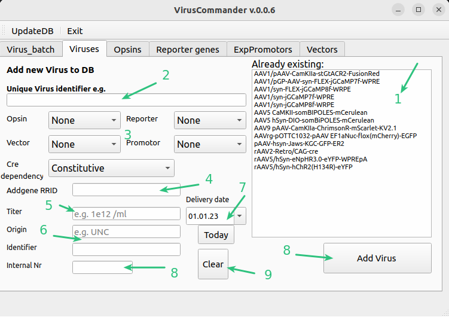
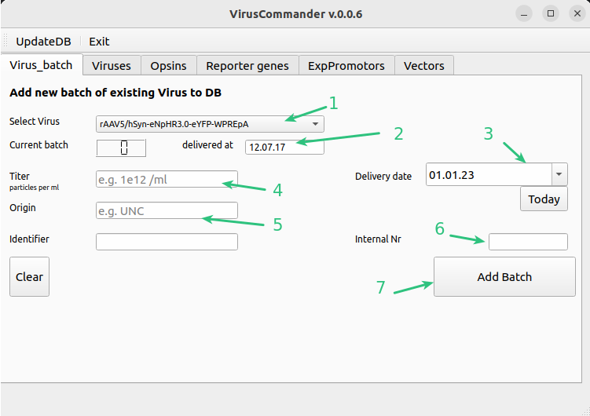
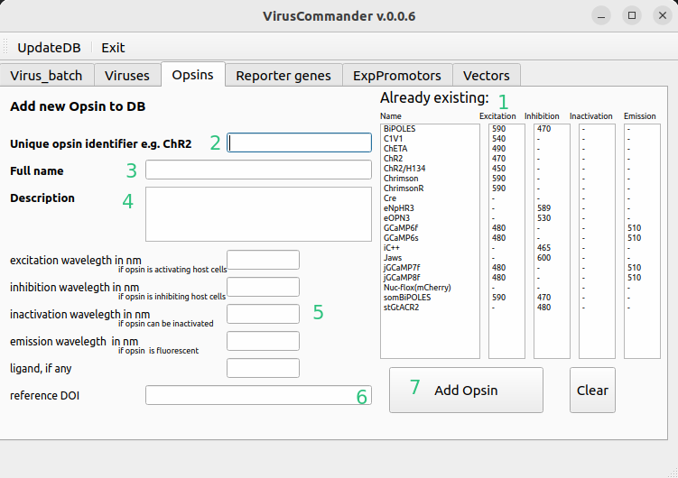
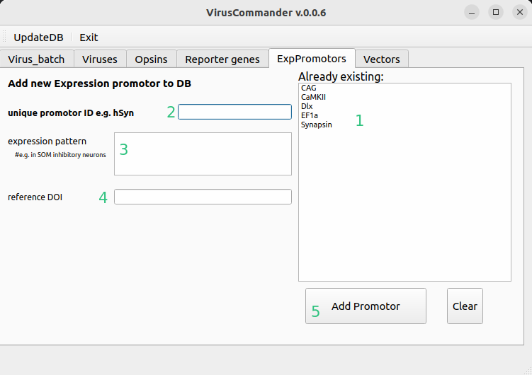
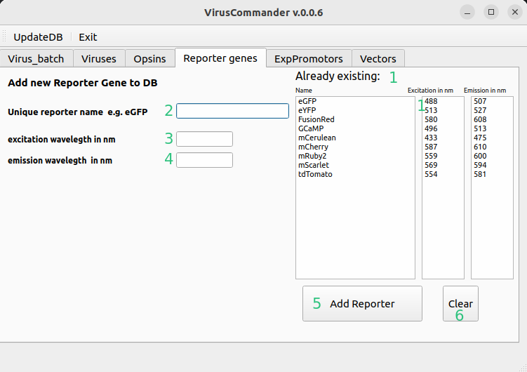
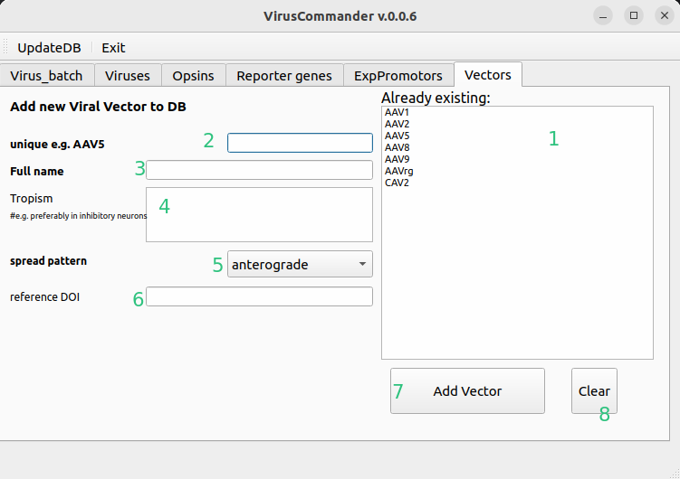

# VirusCommander
Tool for entering new viruses, batches of viruses, opsins, promotors etc. into the Database.
Having the viruses in the  database and associated with animals via surgey will allow easy search what was done with any
given virus and with what results.

Entering a virus or virus batch here will automatically push it also to eLabFTW.

:::{note}Start
From the datastructure_tools directory run
~~~bash
python ./VirusCommander.py
~~~
or from any directory
~~~bash
python -m datastructure_tools virus
~~~
:::
:::{error}
:class: dropdown

In case you get this error, no connection can be established to MySQL. Ensure you entered correct credentials 
first using [AdminCommander](AdminCommander.md#db-configuration).
:::

## Add a new virus to DB
A new virus can be added and connected to its properties such as promots, opsin etc.
Option you need is not available? Add new one as indicated later.

1. List of viruses already in DB. Please check whether yours is already available (small variations in naming are possible)
2. Unique full name of the virus. Try to keep the convention similar to already added viruses
3. Parts of the virus, Opsin if any, Reported protein, Vector , Promotor etc. Whether the expression is dependent 
on cre presence.
4. Addgene identifier (optional)
5. Titer in particles/ml can be entered using 1e12 notation
6. Virus origin and identified of supplier
7. Delivery date
8. Our internal box id where the aliquoted virus is stored.
9. Add virus
10. Clear fields

## Add new batch of an existing virus
Here we can add a newly delivered batch of an already existing virus.

1. Choose a virus (has to be in DB)
2. Information about current batch (delivery date)
3. Enter new delivery date
4. Titer in particles/ml can be entered using 1e12 notation
5. Virus origin and identified of supplier
6. Our internal box id where the aliquoted virus is stored.
7. Add entry

## Add opsin to DB
Here new opsins can be entered. Here opsin is loosely defined as the functional payload of the virus and thus incldues 
Cre or GCaMPs.

1. Already existing opsins
2. Short unique name
3. Full name
4. Description of some details
5. Please enter functional wavelegths for inhibition, excitation if opsins are modulating neural activity.
6. DOI of the paper presenting the vector (optional)
7. Add entry

## Add new promotor 
Here new expression promotors can be added.

1. Already existing expression promotors
2. Short unique name
3. Expression pattern (optional)
4. DOI of the paper presenting the vector (optional)
5. Button to add

## Add new reporter gene
Here new reported genes (fluorescent proteins) can be entered.

1. Already existing reporter genes
2. Short unique name
3. Excitation wavelength
4. Emission wavelength (signal)
5. Button to add
6. Clear fields

## Add new vector
Here new vectors (serotypes of viruses or differen virus-types can be entered)

1. Already existing vectors
2. Short unique name
3. A bit more descriptive name
4. Some description of specific tropism of the virus if any is known. (optional)
5. Spread pattern of the virus
6. DOI of the paper presenting the vector (optional)
7. Button to add
8. Clear fields

~~~~
written by: Artur
last modified: 2024-01-30
~~~~