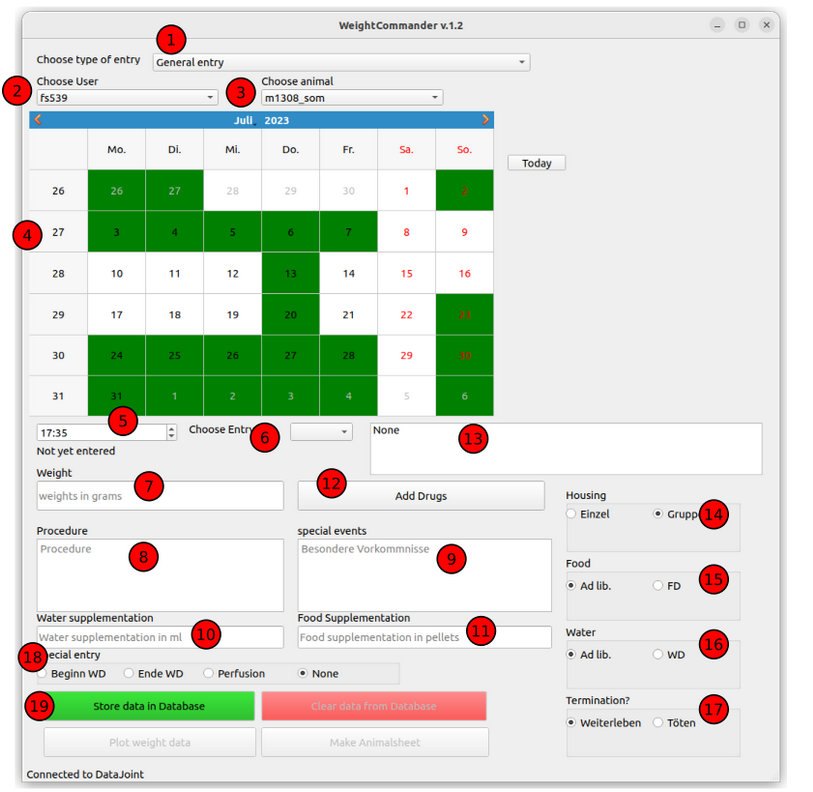

# WeightCommander
GUI-Doc
To be continued

Author: Florian

1. [Choose Entry type](#choose-entry-type)
2. [Choose User](#choose-user)
3. [Choose Animal](#choose-animal)
4. [Choose Date](#choose-date)
5. [Choose Time](#choose-time)
6. [Choose DB Entry](#choose-db-entry)
7. Specify Weight
8. Specify Procedure
9. Specify special events
10. Specify Water supplementation in ml
11. Specify Food Supplementation in pellets
12. Open Add drugs window
13. Display for chosen drugs
14. Choose Housing
15. Choose Food (Ad lib. vs. FD)
16. Choose water (Ad lib. vs. WD)
17. Choose termination (Weiterleben vs. Toetung)
18. Choose special entries (Start and end of Waterdeprivation and perfusion
19. Store data

## Choose Entry type
To simplify input, one can choose between General entry, Kontrolle, Training, Waterdeprivation, End of Waterdeprivation and Perfusion.
General entry allows the user to specify everything as wished.
Kontrolle automatically inserts a standard procedure and sets food and water to ad lib.
Training automatically inserts a standard procedure and sets water to WD
Waterdeprivation marks the inserted weight as a start of water deprivation weight. The ZWR will be the same as the time that is chosen for the weight. Water is set to ad lib.
End of Waterdeprivation will allow the user to input a time of end of water deprivation. The weight will be marked as the end of water deprivation weight.
Perfusion will set termination? to Toetung. 

## Choose User:
Pressing this will open a dropdown that allows to choose a user that is already implemented in the database. Choosing a user will change the organization of the displayed animals (see choose animal). The user chosen here will be set as the person that inserted the animal sheet entry.

## Choose Animal:
This dropdown will be sorted according to the following rule: Living animals of chosen user, Dead animals of chosen user, all other animals

## Choose Date:
The calendar widget will show all the dates that already have an Animalsheet entry marked as green. One can now choose a date that we want to either read out or insert a new animalsheet entry to

## Choose Time:
If there already is an animalsheet entry on this date, the choose time input will automatically switch to the time of the animalsheet entry. One can now specify a different time to enter a new animal sheet entry. If one does not do this, the animalsheet entry cannot be created, as there cannot be two entries with the same date and time.

## Choose DB Entry:
If on one day there are multiple Animalsheet entries, this dropdown will contain all the entries that are already in the database. Upon choosing an entry, the data shown will be updated.

## Specify weight:
This entry is necessary for storing a new animalsheet entry. The weight needs to be inserted in grams, with comma as a separator.

## Specify procedure:
This field allows the user to specify the procedure done with the animal as displayed in the animal sheet.

## Specify special events:
This field allows the user to specify the special events if there were any. This will be displayed in the animal sheet.

## Specify Water supplementation in ml

## Specify Food Supplementation in pellets

## Open Add drugs window
Pressing this button will open a new window that allows you to choose the drugs that were used on the day. Choosing the buttons and pressing okay will display them in the display of chosen drugs

## Display for chosen drugs
Here you can inspect the drugs administered on a given day (as specified in the animalsheet entry). If you are currently inserting a new entry, the window displays the drugs that were chosen in the choose drugs window.

## Choose Housing
Select if the mouse was group or single housed. Choosing one entry will disable the other.

## Choose Food (Ad lib. vs. FD)
Select if the mouse had unlimited access to food or not. Choosing one entry will disable the other.

## Choose water (Ad lib. vs. WD)
Select if the mouse had unlimited access to water or not. Choosing one entry will disable the other.

## Choose termination (Weiterleben vs. Toetung)
Select if the animalsheet entry was final or not. Choosing one entry will disable the other.

## Choose special entries (Start and end of Waterdeprivation and perfusion)
This allows you to choose if the given date was a start of water deprivation, end of waterdeprivation, a perfusion or none of the above. The entries in the database will be slightly different for start or end of waterdeprivation (as the ZWR and ZWD is stored). If the entry is a start of waterdeprivation, the ZWR will be the time of entry. If it is an end of waterdeprivation, the ZWD has to be specified.

## Store data
pressing this button will store the inserted data to the database. Careful, removing it is not possible in the current weight commander.

~~~~
written by: Florian
last modified: 2024-01-22
~~~~